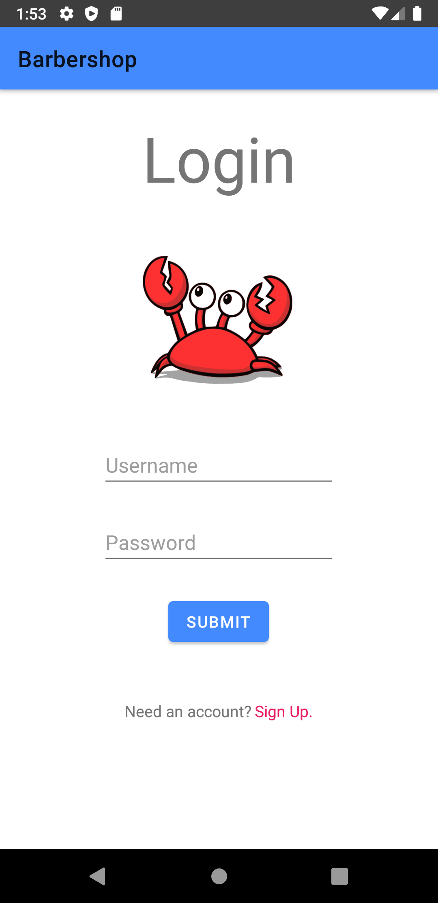
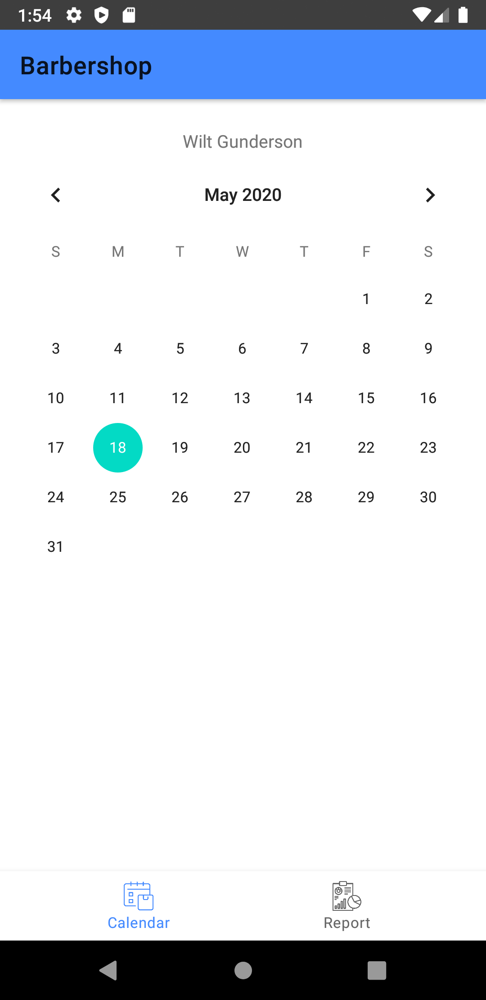
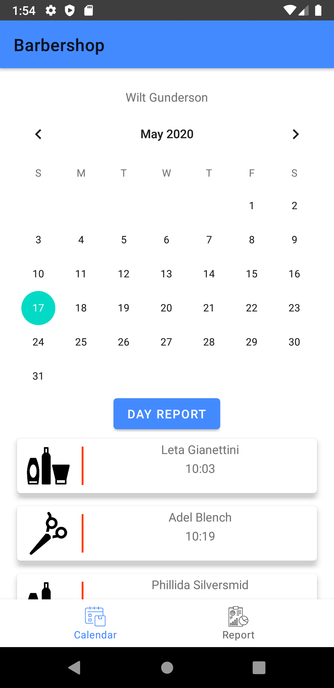
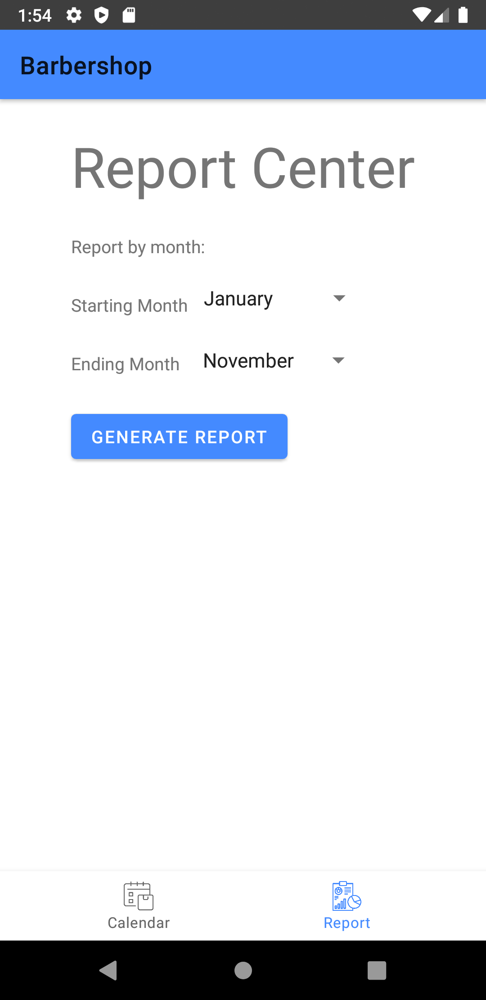

# Android application of Snip-Snap
The Android portion of the barber shop application deals with all barber administrative duties.  

## Login
The user's username and password are validated by our GRAPHQL GO API.   
 
  

## Calendar
Once a barber is logged in, the first thing they will be greeted by is their calendar which holds their appointments. The initial build did not include highlights to indicate days that contain appointments. That will be added later.  
 
  

## Appointments
When a barber selects a day that has scheduled appointments, the appointments info will show up in card form. At this point in the project, only the time and the symbol that is supposed to represent the appointment type shows up in the card. Other things that are to be displayed include the service price and other at-a-glance information.  
 
Additionally, a barber may choose to generate a day report by clicking the day report button.  
 
  

## Reports
When it comes time to print out a barber's report, they can do it per day as can be seen in previous screens, or go to a dedicated report center. The dedicated report center is able to generate reports by year per a range of months. The per year feature is still in development.   
 
  
